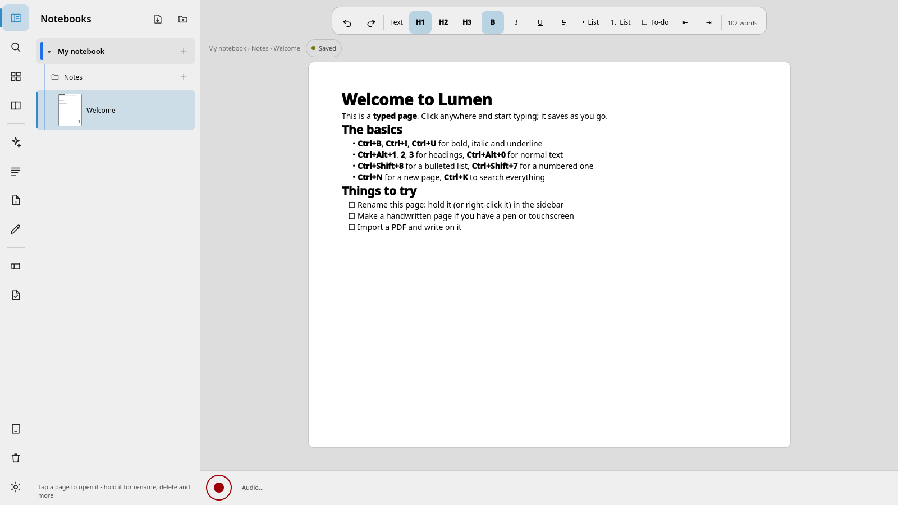
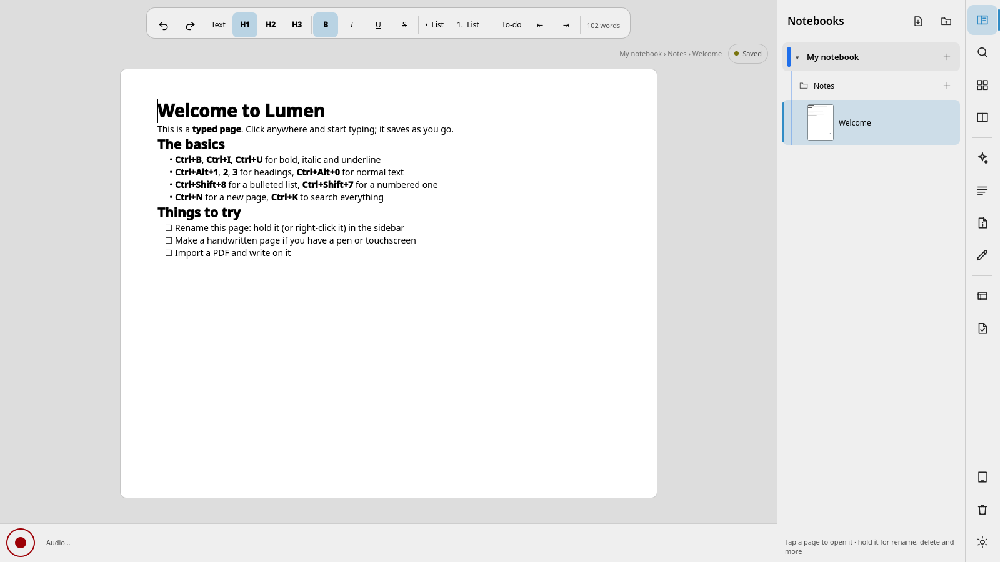
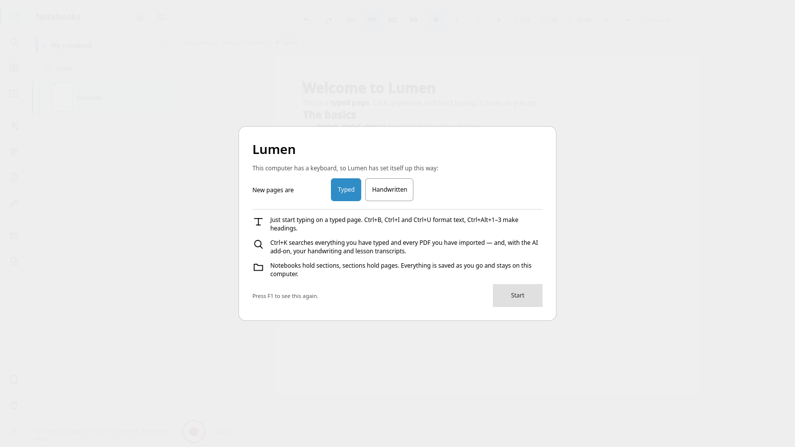

# Lumen

Pen, touch and keyboard notes, in one app: ink, PDF annotation, typed pages, and notebooks that
hold sections that hold pages. Built for a Qt/QML tablet-and-keyboard machine (a Galaxy Book5 360
with an S Pen), works with mouse and keyboard too.

- **Write** with a pen, highlighter, eraser or lasso; shapes and straight lines recognise
  themselves; pages come in dotted, lined, squared, graph, isometric, music-stave or Cornell
  styles, in four paper colours.
- **Import and annotate PDFs** — a PDF becomes a section, one page per slide, with text selection,
  a highlighter that snaps to lines, and export back to PDF with your ink baked in.
- **Type** Markdown blocks alongside your ink, with `$\LaTeX$` maths rendering, and turn
  handwritten maths into LaTeX locally.
- **Organise** as notebooks → sections → pages, with full-text search across typed text,
  recognised handwriting, audio transcripts and PDFs (Ctrl+K). Link pages with `[[Page title]]`
  (links survive renames, and every page lists what links to it), tag pages (or lasso some
  handwriting and make it a tag), and step back and forward through the pages you've visited.
- **Two pages side by side** (a PDF and your notes, say), each with its own tools and zoom, and
  **present** a section full screen with a laser pen that fades (F5).
- **Share a notebook** as a single `.lumen` file — ink, text, links, pictures and PDFs inside it.
- **Record lessons**: capture audio with live transcription (faster-whisper), tap-to-hear jumps to
  the moment a stroke was written, and marks let you flag a moment to come back to.
- **Flashcards** with FSRS scheduling, plus Anki `.apkg` import/export.
- **Past papers**: import a paper and mark scheme, track marks and topics per question, and see a
  dashboard of your weakest topics over time.
- **Fits the hand holding the pen**: a left-handed layout moves the tool rail and panels out from
  under your hand, and holding any button shows what it does without doing it.
- **Optional AI add-on** (see below): notes from a recording, flashcard suggestions, explaining a
  selection, asking your notes questions — every prompt is shown before it's sent, and audio never
  leaves the machine.

Everything above works offline. Only the AI add-on needs anything outside the machine, and only
when you send a prompt.

See [docs/USER-GUIDE.md](docs/USER-GUIDE.md) for the full shortcut and workflow reference.

## Screenshots





## Install

Grab the latest build from this repo's [Releases](../../releases) page:

- **Windows** — download and run the `Lumen-Setup-*.exe` installer.
- **Linux** — download the `Lumen-*.AppImage`, `chmod +x` it, and run it (or use your AppImage
  launcher of choice).

Both are built by CI from `main` and from tags; see [Build from source](#build-from-source) if you'd
rather build your own.

## Optional AI add-on setup

Lumen's core (writing, PDFs, search, flashcards, past papers) needs nothing beyond the app itself.
Audio transcription, OCR and PDF import run through small Python workers the app starts and stops
on its own; the AI features (notes from a recording, flashcard suggestions, "ask your notes") also
need the [Claude Code CLI](https://github.com/anthropics/claude-code) on your account.

1. **Python workers** — need Python 3.13 on PATH.
   ```
   scripts/setup-workers.sh          # Linux/macOS: creates workers/../.venv and installs deps
   ```
   On Windows, create the venv the same way (`py -3.13 -m venv .venv`, then
   `.venv\Scripts\pip install -r workers\requirements.txt`) next to wherever you installed Lumen,
   or point `LUMEN_WORKERS_DIR` / put a venv where `workersDir()` looks (see
   `app/src/workers/workersupervisor.cpp`). This step is what makes transcription, OCR and PDF
   import work — without it those features report themselves unavailable, the rest of the app is
   unaffected.
2. **Claude CLI** — `npm install -g @anthropic-ai/claude-code`, then sign in once
   (`claude` from a terminal). Settings → Claude status shows whether Lumen can see it.

## Build from source

Qt 6.5 or newer, CMake 3.25+, a C++20 compiler.

### Linux

Fedora:
```
sudo dnf install cmake ninja-build gcc-c++ ccache \
    qt6-qtbase-devel qt6-qtdeclarative-devel qt6-qtvirtualkeyboard \
    sqlite-devel dbus-devel ffmpeg mpv pulseaudio-utils espeak-ng python3.13
```

Ubuntu:
```
sudo apt install cmake ninja-build g++ ccache \
    qt6-base-dev qt6-declarative-dev qt6-virtualkeyboard-dev \
    libsqlite3-dev libdbus-1-dev ffmpeg mpv pulseaudio-utils espeak-ng python3 python3-venv
```
Ubuntu 24.04's packaged Qt6 is 6.4, below Lumen's 6.5 minimum — use a newer Ubuntu release, or the
[Qt Online Installer](https://www.qt.io/download-qt-installer), if `qmake6 --version` shows less
than 6.5.

Then:
```
scripts/build.sh                 # configure + build + ctest, or drive cmake directly:
cmake -S . -B build -G Ninja -DCMAKE_BUILD_TYPE=RelWithDebInfo
cmake --build build --parallel
```
`scripts/run.sh` launches it from the build tree; `scripts/install.sh` installs it for your user
(`~/.local`) with a launcher entry.

### Windows

Install Qt 6.11.x via the [Qt Online Installer](https://www.qt.io/download-qt-installer) (MSVC
2022 64-bit kit: Qt Base, Declarative and Virtual Keyboard), and Visual Studio 2022's "Desktop
development with C++" workload (for the MSVC toolchain and CMake/Ninja, or install those
separately). From a "Developer PowerShell for VS 2022" prompt:
```
cmake -B build -G Ninja -DCMAKE_BUILD_TYPE=Release -DCMAKE_PREFIX_PATH="C:\Qt\6.11.2\msvc2022_64" ^
    -DLUMEN_BUNDLED_SQLITE=ON -DLUMEN_ENABLE_DBUS=OFF
cmake --build build --parallel
```
`-DLUMEN_BUNDLED_SQLITE=ON` builds SQLite from source (there's no system pkg-config sqlite3 on
Windows); `-DLUMEN_ENABLE_DBUS=OFF` skips the KWin/Plasma tablet-mode integration, which is
Linux-only anyway. Run `windeployqt` on `build\app\lumen.exe` to gather the Qt DLLs and QML
modules before running it outside the build tree.

## Running tests

```
ctest --test-dir build -E app_ui -j2      # everything but the slow UI sweep
ctest --test-dir build --output-on-failure -R <name>   # a single test, e.g. audio, storage, pdf
```
A few tests (`pdf`, `audio`, `ocr`, `maths`, `papers`) exercise the Python workers and need the
venv from [Optional AI add-on setup](#optional-ai-add-on-setup); `worker_ping` and `app_smoke`
only need a plain Python 3 on PATH. `app_ui` (`--uitest`) drives the real window and is slower;
run it on its own with `ctest --test-dir build -R app_ui`.

## Licence

GPL-3.0-or-later. See [LICENSE](LICENSE).
